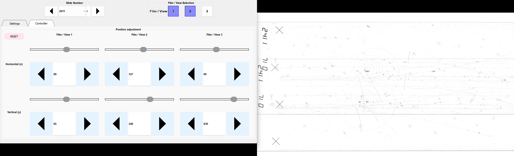
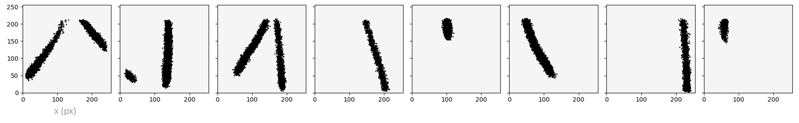
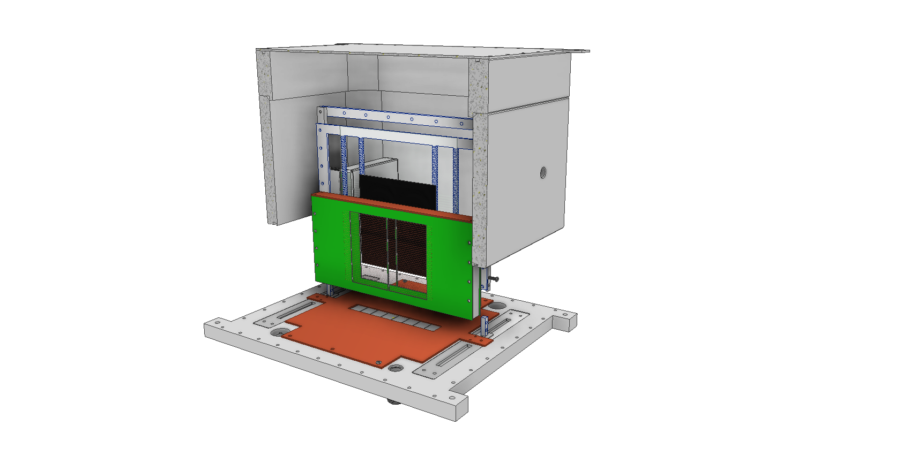
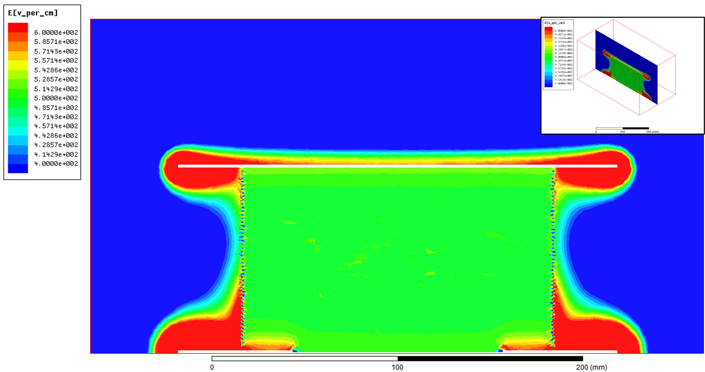
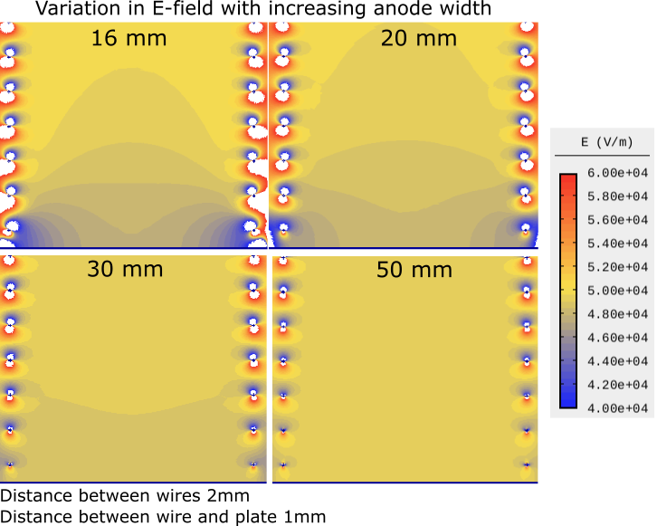
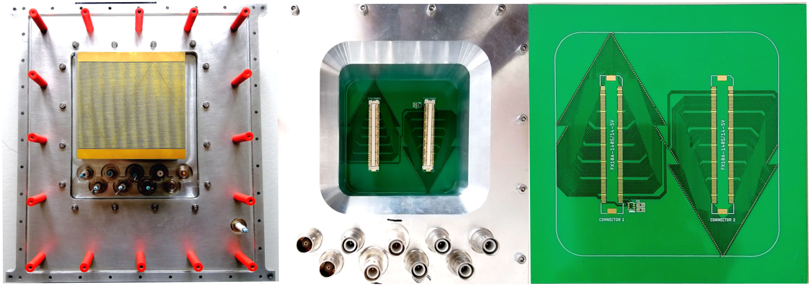
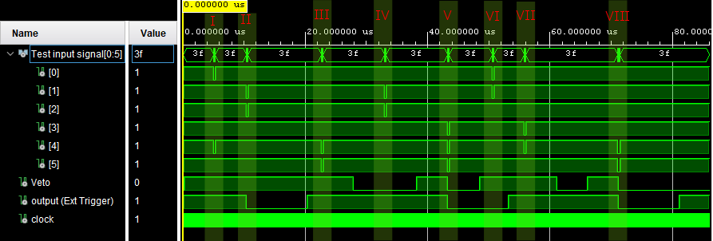
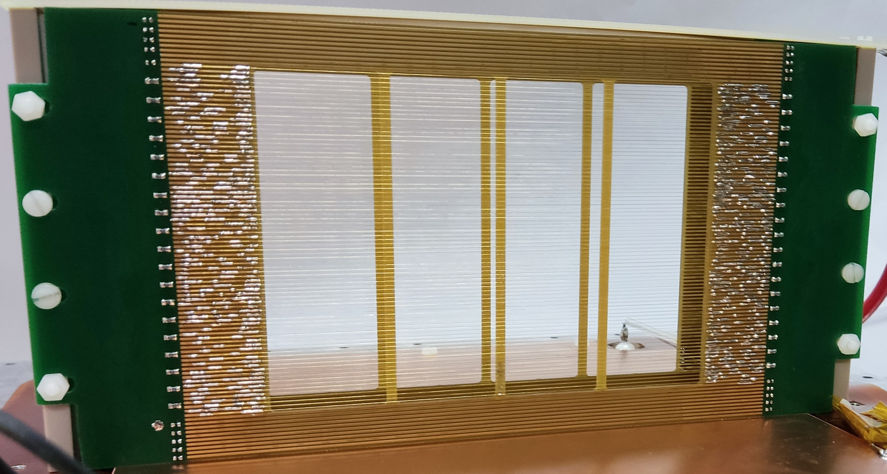
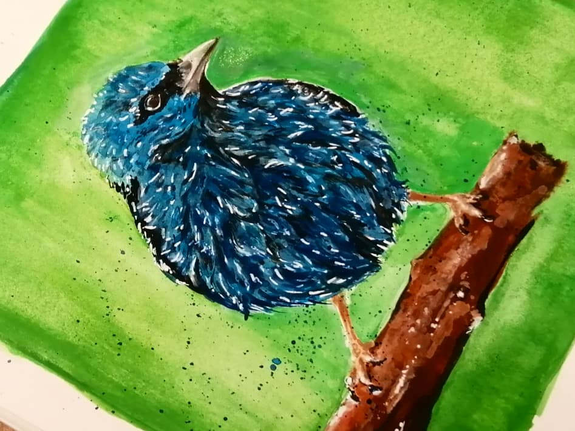

# Experimentalist

## About me
I am a trained physicist who likes to bring ideas to reality. My interests range from hardware and software development to data analysis. 

## Software development
* Interaction and projection system using python and PyQt:

[See project](Software/BubbleD)

## Data Analysis

* Particle search using clustering algorithms in python:

## Hardware development

* Particle detector design using Autodesk :

* Electric field simulation using Ansys and Agros2D:

* PCB designing for particle detectors using Eagle:

* FPGA programing for data acquisitions boards using Xilinx Vivado:

* Hardware and PCB assembly

## Creativity
* Trained painter

